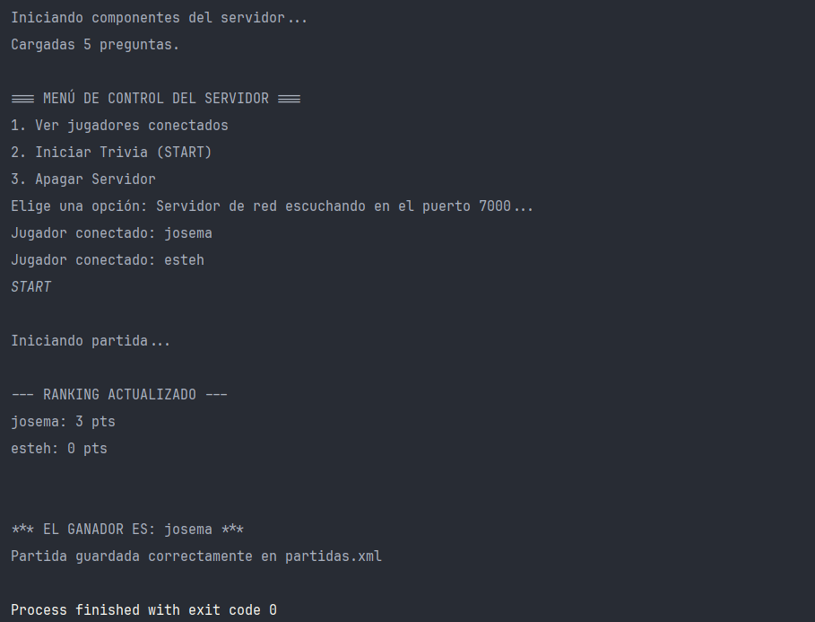
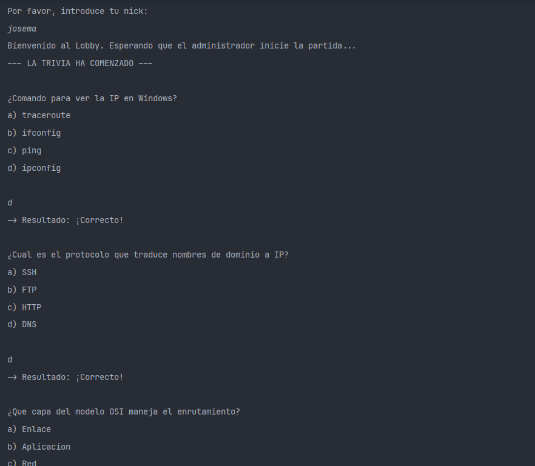
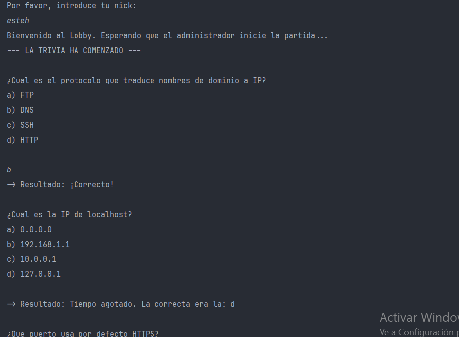

# Memoria de la Práctica 1.2: Trivia en Red (Sockets en Java)

## 1. Descripción del Proyecto
Esta práctica consiste en el desarrollo de una aplicación Cliente-Servidor en Java utilizando Sockets TCP. El objetivo es simular un juego de Trivia multijugador en tiempo real (hasta 10 jugadores) dentro de una red local.

Además de los requisitos básicos, el proyecto ha sido ampliado y refactorizado para cumplir con principios de diseño de software (Responsabilidad Única), eliminando estructuras complejas (como lambdas o expresiones anónimas) y añadiendo las siguientes **funcionalidades extra**:
1. **Sala de Chat (Lobby):** Los jugadores pueden chatear mientras esperan que el administrador inicie la partida.
2. **Sistema de Rachas y Penalizaciones:** Aciertos consecutivos dan puntos extra, mientras que los fallos restan puntos.
3. **Carga dinámica de preguntas:** Las preguntas se leen desde un archivo `preguntas.txt`. Si no existe, el servidor lo autogenera para evitar caídas.
4. **Aleatoriedad individual:** Cada jugador recibe las preguntas en un orden distinto, y las opciones (a, b, c, d) se mezclan dinámicamente en cada pantalla.
5. **Persistencia de datos:** Al finalizar, la tabla de puntuaciones se exporta a un archivo `partidas.xml`.

---

## 2. Arquitectura y Funcionalidad de las Clases

Para mantener el código limpio, escalable y libre de bloqueos, el sistema se ha dividido en **8 clases** estructuradas según su rol en la aplicación:

### Clases del Servidor y Lógica
* **`Servidor` (El Cerebro Global):** Es el hilo principal. Coordina la partida, almacena la lista global de jugadores conectados y el banco general de preguntas. Controla el flujo de las rondas (los tiempos de espera de 10 segundos) y calcula el ranking final aplicando un algoritmo de ordenación manual (Método Burbuja).
* **`HiloConexiones` (El Recepcionista):** Su única función es abrir el puerto `7000` y quedarse escuchando indefinidamente. Cuando un nuevo jugador entra, le crea su propio `ClienteHandler` y lo añade a la lista, permitiendo que el servidor acepte conexiones sin detener su ejecución.
* **`ConsolaServidor` (El Panel de Control):** Interfaz exclusiva para el administrador. Permite leer comandos por consola (ver jugadores, iniciar el juego con `START` o apagar) en un hilo paralelo, garantizando que el administrador pueda interactuar en cualquier momento.
* **`ClienteHandler` (El Asistente Personal):** Es un hilo que se crea en el servidor por cada jugador conectado. Gestiona la comunicación directa y exclusiva con ese cliente. **Aquí reside la lógica de aleatoriedad**: mezcla las preguntas de forma independiente para su jugador, mezcla las respuestas antes de enviarlas por la red y evalúa si la respuesta enviada coincide con la correcta.

### Clases del Cliente
* **`Cliente` (El Transmisor):** Es la clase que ejecuta el usuario. Establece la conexión por Socket con el servidor. Su hilo principal se dedica únicamente a leer lo que el jugador escribe en su teclado y enviarlo por la red (ya sea un mensaje de chat o una letra para responder).
* **`HiloLecturaCliente` (El Receptor):** Hilo secundario que corre en la máquina del jugador. Se encarga de escuchar permanentemente todo lo que envía el servidor (notificaciones, preguntas, resultados de otros). Al estar separado, el jugador puede leer mensajes nuevos sin que su teclado se bloquee.

### Clases de Datos y Persistencia
* **`Pregunta` (El Modelo de Datos):** Una estructura simple que encapsula el enunciado de una pregunta, una lista con las 4 opciones posibles y una cadena de texto con el valor exacto de la respuesta correcta (necesario para validarla tras desordenar las opciones).
* **`GestorArchivos` (Lectura y Escritura):** Concentra la lógica de Entrada/Salida de ficheros. Contiene la lógica para extraer las preguntas del `preguntas.txt` usando `BufferedReader` y para estructurar y guardar el ranking final en formato jerárquico dentro de `partidas.xml` utilizando las librerías DOM clásicas de Java.

---

## 3. Pruebas de Ejecución (Demo)

A continuación, se muestran las capturas de pantalla que demuestran el correcto funcionamiento del sistema con el Servidor y múltiples clientes conectados jugando de forma simultánea.

### 💻 Consola del Servidor (Administrador)
*(El servidor arranca, los jugadores se conectan, el admin inicia la partida con START y se genera el archivo XML al finalizar).*

### 🎮 Consola Cliente 1
*(El jugador se conecta, chatea en el lobby, recibe las preguntas desordenadas, responde y ve su puntuación final).*

### 🎮 Consola Cliente 2
*(El segundo jugador interactúa en el mismo juego, pero se aprecia que el orden de sus preguntas y la posición de las respuestas (a, b, c, d) es diferente al del Cliente 1).*
