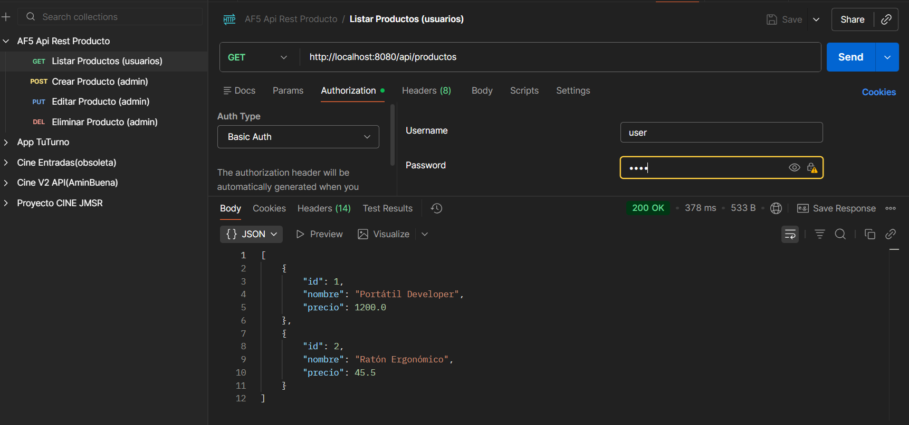
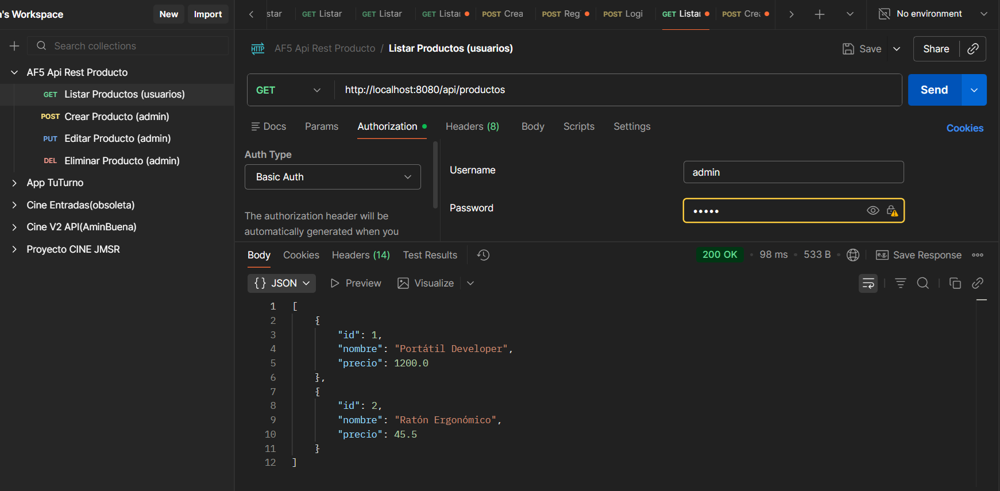
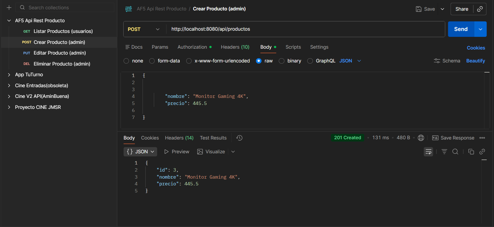
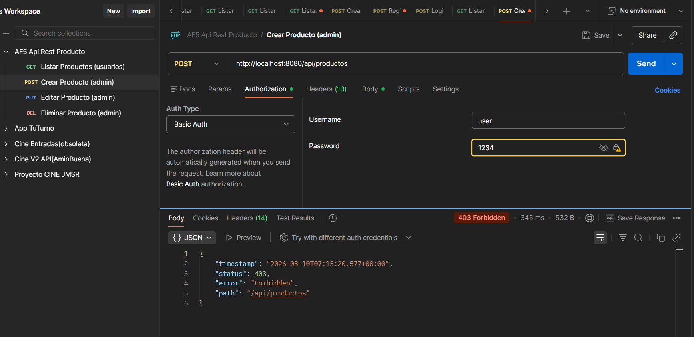

# AF5 Proyecto Dual PSP: Servicio REST Seguro

Este proyecto implementa una API REST para la gestión de productos, desarrollada con **Spring Boot 3.2.2** y asegurada mediante **Spring Security**, cumpliendo íntegramente con los Resultados de Aprendizaje **RA4** y **RA5** del módulo de Programación de Servicios y Procesos.

## 1. Estructura y Tecnologías
* **Paquete Base:** `org.AF5_PSP_Dual_JMSR`
* **Tecnologías:** Java 21, Spring Boot 3.2.2, Maven.
* **Seguridad:** Spring Security (Autenticación Basic Auth en memoria).
* **Diseño:** Arquitectura MVC (Modelo-Vista-Controlador) con gestión de estado en memoria concurrente (Thread-Safe).

## 2. Evidencias de Evaluación (Justificación de Criterios)

### RA4 - Servicios en Red (API REST)
Hemos desarrollado la clase `ProductoController.java` para exponer el servicio:

* **(RA4.a, RA4.b, RA4.c) Uso de librerías y protocolos estándar:**
  Utilizamos `spring-boot-starter-web` para implementar el protocolo HTTP/1.1 de forma nativa. La serialización a JSON es automática gracias a la librería Jackson.

* **(RA4.d, RA4.e) Concurrencia y gestión de clientes:**
  El servicio se despliega sobre un contenedor Tomcat embebido que gestiona múltiples hilos simultáneamente. Para garantizar la integridad de los datos en un entorno concurrente real, se han implementado:
  * `CopyOnWriteArrayList`: Para evitar excepciones y bloqueos si múltiples hilos leen y escriben a la vez.
  * `AtomicInteger`: Hemos sustituido el cálculo de IDs basado en `size()` por un contador atómico independiente (`contadorIds`) para asegurar la generación de IDs únicos sin condiciones de carrera (Race Conditions) cuando múltiples clientes crean recursos simultáneamente.

* **(RA4.f) Disponibilidad:**
  El servicio valida su despliegue en el puerto `8080` y responde con códigos de estado HTTP semánticamente correctos (`200 OK`, `201 Created`, `400 Bad Request`, `403 Forbidden`, `404 Not Found`).

**Endpoints implementados:**
* `GET /api/productos`: Listado público (rol User/Admin).
* `POST /api/productos`: Crear (Solo Admin).
* `PUT /api/productos/{id}`: Modificar (Solo Admin).
* `DELETE /api/productos/{id}`: Borrar (Solo Admin).

### RA5 - Seguridad y Protección
Hemos protegido la aplicación en la clase `SecurityConfig.java`:

* **(RA5.h) Principios de programación segura y Validación:**
  Ningún endpoint es público. Se fuerza la autenticación en todas las peticiones (`anyRequest().authenticated()`). Además, protegemos la integridad de la aplicación mediante un método de validación estricta (`esValido()`) en el controlador, que asegura que el nombre del producto no sea nulo ni contenga solo espacios en blanco antes de procesarlo tanto en la creación (`POST`) como en la modificación (`PUT`), devolviendo un `400 Bad Request` si los datos son inválidos.

* **(RA5.k) Esquemas basados en roles:**
  Hemos definido dos roles diferenciados en memoria mediante `InMemoryUserDetailsManager`:
  * `USER`: Perfil de consulta.
  * `ADMIN`: Perfil de gestión completa.

* **(RA5.j) Control de acceso y Políticas:**
  Aplicamos el principio de mínimo privilegio. Las operaciones destructivas (`DELETE`, `PUT`) o de creación (`POST`) están blindadas exclusivamente para el rol ADMIN mediante un uso exhaustivo de `requestMatchers` para cubrir tanto las rutas base como las subrutas.

## 3. Pruebas de Funcionamiento y Validaciones (Postman)

Se ha verificado el correcto funcionamiento del ciclo de vida CRUD y la seguridad mediante el control de acceso basado en roles (RBAC) sobre los endpoints desarrollados. A continuación se presentan las evidencias de las pruebas:

### 3.1. Acceso Permitido de Lectura (Rol: USER / ADMIN)
Ambos roles tienen permisos para consultar el catálogo. El sistema devuelve un estado `200 OK`.

**Prueba de listado con credenciales USER:**

**Prueba de listado con credenciales ADMIN:**

### 3.2. Operación de Escritura Autorizada (Rol: ADMIN)
El administrador realiza una petición `POST` válida. El sistema la procesa, autoincrementa el ID de forma atómica y concurrente, y devuelve el recurso creado con el estado `201 Created`.

**Prueba de creación con credenciales ADMIN:**

### 3.3. Acceso Denegado por falta de privilegios (Rol: USER)
El usuario con rol `USER` intenta ejecutar una operación restringida (añadir un producto mediante `POST`). El filtro de Spring Security intercepta la petición antes de llegar al controlador, denegando la acción y devolviendo correctamente un estado `403 Forbidden`.

**Prueba de operación denegada con credenciales USER:**

### 3.4. Anexo: Gestión Integral de Códigos de Estado HTTP (RA4 y RA5)

Para garantizar el cumplimiento riguroso de los protocolos estándar HTTP (RA4.a) y una correcta política de seguridad y validación (RA5.j, RA5.h), esta API devuelve códigos de estado semánticos dependiendo del resultado de la operación y los permisos del cliente:

| Código HTTP | Estado | Familia / Concepto | Significado Técnico | Ejemplo en este proyecto |
| :--- | :--- | :--- | :--- | :--- |
| **200** | `OK` | **Éxito** | La petición se ha procesado correctamente y el servidor devuelve los datos solicitados. | Un `GET` exitoso para listar el catálogo o un `PUT` que modifica un producto existente. |
| **201** | `Created` | **Éxito (Creación)** | La petición ha sido exitosa y ha resultado en la creación de un nuevo recurso en el servidor. | Un `POST` válido realizado por el `ADMIN` que genera un nuevo ID en el inventario. |
| **400** | `Bad Request` | **Error de Cliente (Validación)** | El servidor no puede procesar la petición porque la sintaxis es inválida o los datos no cumplen los requisitos. | Intentar hacer un `POST` o `PUT` enviando un producto con el campo "nombre" vacío o nulo. |
| **401** | `Unauthorized` | **Seguridad (Identidad)** | El cliente no ha provisto credenciales válidas o la cabecera de autenticación está ausente. | Intentar acceder a cualquier ruta de `/api/productos` sin configurar la pestaña *Authorization* en Postman. |
| **403** | `Forbidden` | **Seguridad (Autorización)** | El cliente está autenticado correctamente, pero su rol no tiene privilegios suficientes para esa acción. | Un usuario con rol `USER` intentando hacer un `DELETE` o `POST` (acciones exclusivas de `ADMIN`). |
| **404** | `Not Found` | **Error de Cliente (Recurso)** | El servidor no puede encontrar el recurso solicitado en la URL especificada. | Intentar modificar (`PUT`) o borrar (`DELETE`) un producto con un ID que no existe en el inventario (ej. ID 99). |